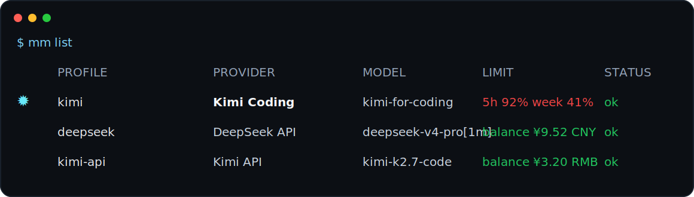
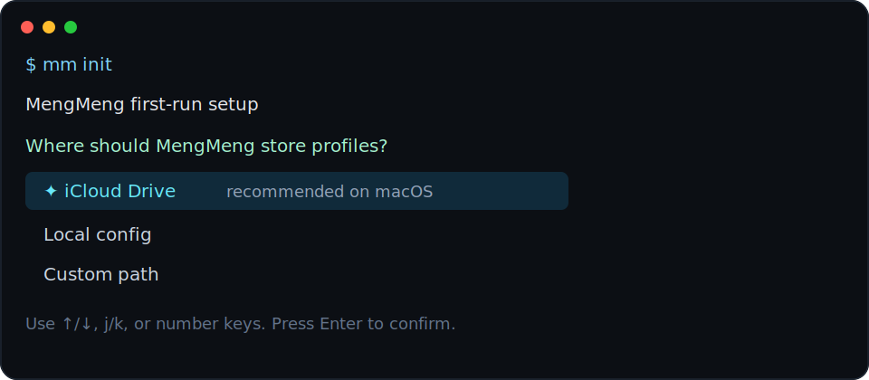
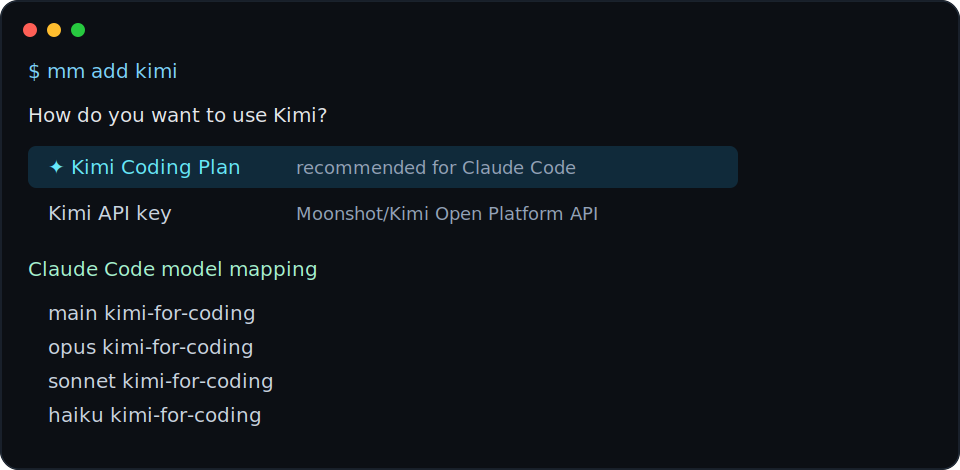
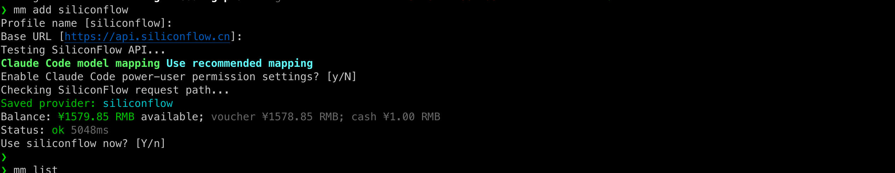
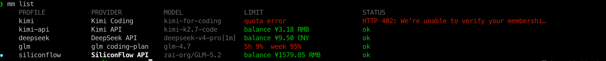
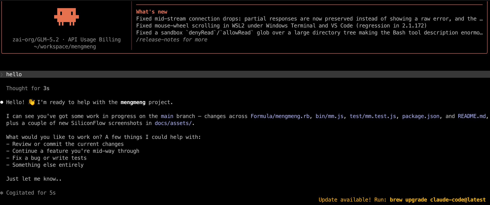
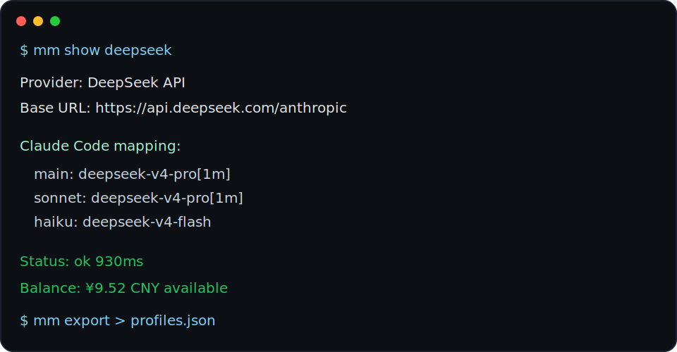

# MengMeng

MengMeng 是一个很小的命令行工具，用来管理 Claude Code 的 provider
配置。

它现在只专注一件事：在 macOS、Linux、SSH 服务器、WSL、远程开发机这些
终端环境里，更省心地配置和切换 Kimi Coding Plan、Kimi API、DeepSeek API、
Zhipu GLM 和 Xiaomi MiMo。

命令名是 `mm`。

它的目标不是把所有 AI 服务都做成一个复杂控制台，而是帮 Claude Code 重度
用户少改几次 `settings.json`，少背几套 provider 环境变量，少踩一点模型映
射和余额查询的小坑。



## 亮点

- 极简命令：`mm init`、`mm add`、`mm list`、`mm use`
- 交互式添加 provider，方向键选择，默认值尽量聪明
- 自动读取 models API，并推荐 Claude Code 模型映射
- `mm list` 同步 quota、余额和连通性状态
- 写入 Claude Code 前自动备份，坏了可以 `mm rollback`
- `mm export` 可以直接迁移配置到另一台只装 Claude Code 的机器

## 它解决什么问题

Claude Code 的 provider 配置本身不复杂，但经常要手动改
`settings.json`，久了就有点烦，也容易出错：

- base URL 要填对
- token 要放到正确的 env 字段
- 不同模型要映射到 Claude Code 的 main / opus / sonnet / haiku
- 切配置时不能把原来的无关设置弄丢
- 改之前最好备份，坏了能回滚
- 多台机器之间最好能导入导出

MengMeng 会把 provider profile 存在自己的配置目录里。你执行
`mm use <profile>` 时，它才把选中的配置写入 Claude Code 的
`settings.json`。

它不是通用 AI 客户端管理器，也不是代理、网关或桌面工具。至少现阶段，它
只是一个给 Claude Code 重度用户用的小 CLI。

## 当前状态

项目还很早。

目前已经实现：

- `mm init` 首次初始化
- `mm add kimi` 添加 Kimi profile，支持 Kimi Coding Plan 和 Kimi API
- `mm add deepseek` 添加 DeepSeek API profile
- `mm add glm` 添加 Zhipu GLM profile
- `mm add mimo` 添加 Xiaomi MiMo Token Plan 或 API profile
- 请求 provider models API，并自动推荐 Claude Code 模型映射
- 可选开启 Claude Code power-user permission 设置
- `mm list` 查看 profile，显示 Coding Plan quota、API 余额、连通性状态和当前 active provider
- `mm use` 切换当前 provider，写入前自动备份
- `show` / `export` / `import` / `remove` / `rollback`
- `version` 查看当前 MengMeng 版本
- `upgrade` 通过安装脚本升级当前 `mm`
- 常用命令支持 `--json`，方便脚本使用

## 当前支持的供应商

| 供应商 | 接入方式 | Claude Code Base URL | 模型发现 | 用量展示 | 状态探测 |
| --- | --- | --- | --- | --- | --- |
| Kimi | Coding Plan | `https://api.kimi.com/coding` | 支持 | 5h / week quota | 支持 |
| Kimi | API key | `https://api.moonshot.ai/anthropic` 或 `.cn` | 支持 | 账户余额 | 支持 |
| DeepSeek | API key | `https://api.deepseek.com/anthropic` | 支持 | 账户余额 | 支持 |
| SiliconFlow | API key | `https://api.siliconflow.cn` | 支持，优先 GLM-5.2 | 账户余额 | 支持 |
| Zhipu GLM | Coding Plan | `https://open.bigmodel.cn/api/anthropic` | 支持，失败回退默认 | 5h / week quota | 支持 |
| Xiaomi MiMo | Token Plan / API key | `https://token-plan-cn.xiaomimimo.com/anthropic` 或 `https://api.xiaomimimo.com/anthropic` | 支持，失败回退默认 | 暂无 | 支持 |

当前只面向 Claude Code。Codex 支持会先留在 roadmap 里，等这个小工具本身足
够稳定再考虑。

## 操作截图

初始化时，MengMeng 会优先识别 macOS 上的 iCloud Drive，也支持本地目录和
自定义路径。



添加 provider 时，MengMeng 会尽量把选择压缩成少数几个清晰选项，然后自动
测试接口、拉模型、推荐 Claude Code 映射。



SiliconFlow 作为正式 provider 接入后，`mm add siliconflow` 会读取模型列表、查询
账户余额，并优先推荐 GLM-5.2 作为 Claude Code 映射。



`mm list` 会展示 SiliconFlow profile 的余额和当前状态，方便切换前快速确认
可用性。



切换到 SiliconFlow profile 后，Claude Code 会直接使用 MengMeng 写入的 provider
配置。



`mm show` 用来检查单个 profile 的映射、余额和状态。`mm export` 可以导出
完整配置，方便迁移。



## 安装

MengMeng 现在是一个零依赖的 Node.js CLI，需要 Node.js 20 或更新版本。

### curl 安装

```sh
curl -fsSL https://raw.githubusercontent.com/jiaqianjing/mengmeng/main/install.sh | sh
```

默认安装到：

```text
~/.local/bin/mm
```

如果你想指定安装目录：

```sh
curl -fsSL https://raw.githubusercontent.com/jiaqianjing/mengmeng/main/install.sh | sh -s -- --bin-dir /usr/local/bin
```

安装脚本只会放置 `mm` 命令，不会修改 Claude Code 配置，也不会自动执行
`mm init`。

升级当前 `mm`：

```sh
mm upgrade
```

`mm upgrade` 默认会把最新版本安装到当前 `mm` 所在目录。源码 checkout 里运行时，
建议用 `git pull` 更新；如果确实要覆盖当前 bin 目录，可以使用
`mm upgrade --force`。

### Homebrew 安装

当前已经有 GitHub release，但 Homebrew formula 仍先走 HEAD 安装：

```sh
brew tap jiaqianjing/mengmeng https://github.com/jiaqianjing/mengmeng
brew install --HEAD mengmeng
```

后面补齐稳定 formula 后，目标是支持：

```sh
brew install mengmeng
```

### 源码本地测试

如果你是从仓库源码测试：

```sh
git clone <repo-url>
cd mengmeng
npm link
```

然后：

```sh
mm init
mm add kimi
mm use kimi
```

如果不想 link，也可以直接开发运行：

```sh
node bin/mm.js --help
npm test
```

## 快速开始

初始化：

```sh
mm init
```

`mm init` 会检测当前系统和常见同步目录。macOS 上如果发现 iCloud Drive，
会优先推荐把 MengMeng profiles 存到 iCloud，方便多台机器共享配置。交互选
择支持方向键 / `j` / `k` / 数字快捷键，并用颜色高亮当前选项。

添加 Kimi：

```sh
mm add kimi
```

交互里可以选择：

- Kimi Coding Plan
- Kimi API key

非交互使用 Kimi Coding Plan：

```sh
KIMI_CODE_API_KEY=sk-xxx mm add kimi --mode coding-plan --yes
```

非交互使用 Kimi API：

```sh
KIMI_API_KEY=sk-xxx mm add kimi --mode api --yes
```

也可以指定读取哪个环境变量：

```sh
MOONSHOT_API_KEY=sk-xxx mm add kimi --mode api --key-env MOONSHOT_API_KEY --yes
```

添加 DeepSeek：

```sh
mm add deepseek
```

非交互使用 DeepSeek API：

```sh
DEEPSEEK_API_KEY=sk-xxx mm add deepseek --yes
```

添加 SiliconFlow：

```sh
mm add siliconflow
```

非交互使用 SiliconFlow API：

```sh
SILICONFLOW_API_KEY=sk-xxx mm add siliconflow --yes
```

添加 Zhipu GLM：

```sh
GLM_API_KEY=xxx mm add glm --yes
```

添加 Xiaomi MiMo：

```sh
MIMO_API_KEY=xxx mm add mimo --mode token-plan --yes
MIMO_API_KEY=xxx mm add mimo --mode api --yes
```

切换 Claude Code 到这个 profile：

```sh
mm use kimi
```

查看当前状态：

```sh
mm list
mm current
mm show kimi
mm doctor
```

`mm list` 会对每个 profile 发起一次低成本连通性探测，并把结果映射到
`STATUS`。探测提示词是“这是一个接口测试，请返回 "ok" 即可。”，
`max_tokens` 为 8。Kimi Coding Plan 的 quota 和 Kimi API 的账户余额也会在
每次 `mm list` 时同步。余额接口没有返回币种时，MengMeng 默认按 RMB 显示。
如果 Claude Code messages 探测失败，`STATUS` 会直接显示精简后的接口错误。

## 命令

```text
mm init
mm version
mm upgrade
mm add kimi
mm add deepseek
mm list
mm current
mm show <profile>
mm edit <profile>
mm use <profile>
mm doctor
mm remove <profile>
mm rollback [backup-id]
mm export [--redact]
mm import <file>
```

`mm remove <profile>` 不允许删除当前 active profile；请先 `mm use <other-profile>`
切到其他配置，再删除原来的 profile。

全局常用参数：

```text
--json
--no-color
```

初始化和添加 profile 时常用的参数：

```text
mm init --config-dir <dir> --claude-config <path>
mm add kimi --name <profile>
mm add kimi --key-env <ENV_NAME>
mm add kimi --key-stdin
mm add kimi --power-user
mm add kimi --yes
mm add deepseek --name <profile>
mm add deepseek --key-env <ENV_NAME>
mm add deepseek --key-stdin
mm add deepseek --power-user
mm add deepseek --yes
```

## `mm use` 会写入什么

激活某个 profile 时，MengMeng 会更新 Claude Code settings 里的 provider
相关 env，例如：

```json
{
  "env": {
    "ANTHROPIC_BASE_URL": "https://api.kimi.com/coding",
    "ANTHROPIC_AUTH_TOKEN": "sk-...",
    "ANTHROPIC_MODEL": "kimi-for-coding",
    "ANTHROPIC_DEFAULT_OPUS_MODEL": "kimi-for-coding",
    "ANTHROPIC_DEFAULT_OPUS_MODEL_NAME": "kimi-for-coding",
    "ANTHROPIC_DEFAULT_SONNET_MODEL": "kimi-for-coding",
    "ANTHROPIC_DEFAULT_SONNET_MODEL_NAME": "kimi-for-coding",
    "ANTHROPIC_DEFAULT_HAIKU_MODEL": "kimi-for-coding",
    "ANTHROPIC_DEFAULT_HAIKU_MODEL_NAME": "kimi-for-coding",
    "ANTHROPIC_DEFAULT_FABLE_MODEL": "kimi-for-coding",
    "ANTHROPIC_DEFAULT_FABLE_MODEL_NAME": "kimi-for-coding",
    "CLAUDE_CODE_SUBAGENT_MODEL": "kimi-for-coding",
    "ENABLE_TOOL_SEARCH": "false",
    "CLAUDE_CODE_AUTO_COMPACT_WINDOW": "262144"
  }
}
```

已有的无关 settings 会保留。写入前，MengMeng 会先备份当前 Claude Code
settings，所以配置写坏了可以用 `mm rollback` 回滚。

如果添加 profile 时启用了 `--power-user`，还会写入 Claude Code 的
permission prompt 相关设置。这个选项比较激进，建议你确认自己知道它的影响
后再开。

## 存储和安全

默认 MengMeng 配置目录：

```text
~/.config/mengmeng/
```

默认 Claude Code settings 路径：

```text
~/.claude/settings.json
```

可以用环境变量覆盖：

```sh
MENGMENG_HOME=/path/to/mengmeng
MENGMENG_CLAUDE_CONFIG=/path/to/settings.json
```

注意：当前版本会把 profile 数据，包括 API token，存在本地 JSON 文件里，并
设置为仅当前用户可读写。`mm export` 默认会导出完整 profile，包括 token，
方便迁移到另一台机器。需要分享给别人看结构时，使用 `--redact` 脱敏。

## 名字

名字没什么高深含义。

一开始只是想写个自用小工具，但起名卡住了。正好我三岁的女儿萌萌跑过来喊
我陪她玩，于是就先叫它 MengMeng。

后来发现 `mm` 这个命令还挺顺手，就留下来了。

## 后续供应商征集

MengMeng 不打算一次性接入所有 provider。每新增一个 adapter，都应该真正省
掉 Claude Code 用户的重复配置工作，而不是只把表格变长。

目前欢迎优先讨论这些候选：

| 候选供应商 | 可能的接入方式 | 需要确认的问题 |
| --- | --- | --- |
| Qwen / ModelStudio | API key | Claude Code 兼容方式、模型映射、余额接口 |
| 火山方舟 / Doubao | API key | Anthropic-compatible 支持和模型命名 |
| OpenRouter | relay | 余额接口、模型别名和成本展示 |
| 通用中转站 | Anthropic-compatible / OpenAI-compatible | 最小配置模板、连通性探测、导入导出 |

如果你希望下一个版本支持某个 provider，最有帮助的信息是：

- Claude Code 可用的 base URL
- 一把只用于测试的最小权限 API key
- models API、余额 API、quota API 文档
- 你希望 main / opus / sonnet / haiku 分别映射到哪些模型

可以直接开 issue：<https://github.com/jiaqianjing/mengmeng/issues>

## Roadmap

近期可能会做：

- 稳定 Homebrew formula
- shell completions
- 更清楚的模型推荐解释
- 更稳定的 quota 展示
- 更完整的 custom relay profile
- GLM、MiMo 的 quota / 余额展示
- Codex 支持，等 Claude Code 体验稳定后再评估

暂时不做：

- 本地代理层
- 自动 failover
- 通用 JSON 编辑器
- 覆盖所有 AI coding 工具

## 支持与赞助

MengMeng 现在还是一个很早期的自用工具。如果它帮你少折腾了一次 Claude
Code 配置，最直接的支持是：

- 给项目点一个 Star
- 提交 provider 接入信息或真实使用反馈
- 帮忙测试 macOS / Linux / SSH / WSL 环境
- 提 PR 修文档、补截图、加 adapter

后续如果真的有人长期使用，我会补上更正式的赞助方式，比如 GitHub Sponsors、
爱发电或微信赞赏码。现在先不放二维码，等项目体验和 release 流程更稳定后
再说。

## License

TBD.
